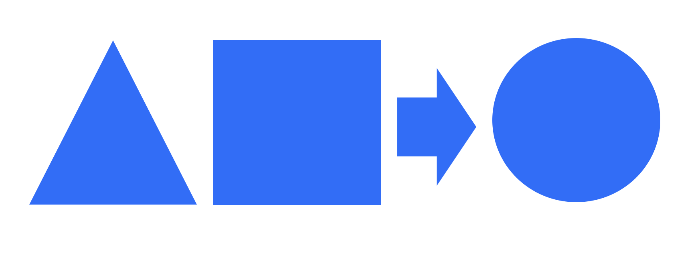

[//]: # (![Coverage Report]&#40;./assets/coverage.svg&#41;)

# TORCHLOGIC DOCUMENTATION

_torchlogic_ is a pytorch framework for developing Neuro-Symbolic AI systems
based on [Weighted Lukasiewicz Logic](https://arxiv.org/abs/2006.13155) that we denote as _Reasoning Networks_.  
However, the design principles of the _torchlogic_ framework depart from previous related works to provide a
critical breakthrough in computational efficiency for Neuro-Symbolic AI, full GPU scaling.

### Design Principles

- _Neural == Symbolic_: Symbolic operations should not deviate computationally from Neural operations and leverage PyTorch directly
- _Masked Tensors_: Reasoning Networks use tensors and masking to represent any logical structure _and_ leverage GPU optimized computations
- _Neural -> Symbolic Extension_: Symbolic operations in _torchlogic_ are PyTorch Modules and can therefore integrate with existing Deep Neural Networks seamlessly

With these principles, _torchlogic_ and Reasoning Networks are able
to extend and integrate with our current state-of-the-art technologies that leverage advances in 
Deep Learning.  Reasoning Networks developed with _torchlogic_ can scale with
multi-GPU support enabling reasoning at speeds not previously possible.  Finally,
those familiar with PyTorch development principles will have only a small step
in skill building to develop with _torchlogic_.  Happy reasoning!

### Documentation

The current code is in an Beta state so there may be some bugs.  We've established a
stable set of functionality and want to hear from you on how to improve further!  We'll do our best to keep the 
documentation up to date with the latest changes to our API reflected there.

### Tutorial

The best way to get started using torchlogic is by exploring the various tutorials.
There are several tutorials demonstrating how to use the Bandit-NRN algorithm
in multiple use cases.  The tutorials demonstrate the key concepts in torchlogic and
when using Reasoning Networks for explainable AI solutions.  These concepts are
also discussed in more theoretical terms in the Data Science section of this
documentation.

[Tutorial Source](./tutorials/brn.md)

### Data Science

To understand the basic of the torchlogic framework and Reasoning Networks
check out the [Data Science](./ds/rn.md) section, which gives an introduction to some of the
models developed so far using torchlogic.

